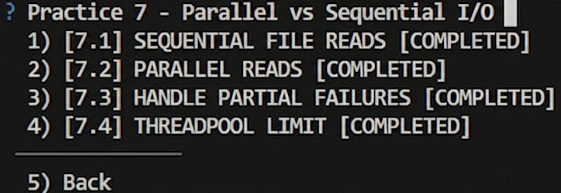

# ПРАКТИЧНА РОБОТА № 7

**Тема:** Порівняння Parallel vs Sequential I/O (eu-node-basics-workshop)  

**Виконав:** Макаренко Іван, студент 2 курсу (Кібербезпека)


## Опис виконаної роботи


У цій роботі було досліджено різні підходи до виконання асинхронних операцій у Node.js, зокрема роботу з файловою системою та потоками (Threadpool).


### Реалізовані завдання:


1. **7.1 Sequential File Reads (`sequential_file_reads.js`)** Реалізовано послідовне читання файлів `a.txt`, `b.txt`, `c.txt`. Кожен наступний файл починає зчитуватися тільки після повного завершення попереднього. Це найнадійніший, але найповільніший спосіб.


2. **7.2 Parallel Reads (`parallel_reads.js`)** Використано `Promise.all()` для одночасного запуску читання всіх трьох файлів. Це дозволяє суттєво скоротити час виконання (`elapsedMs`), оскільки операції I/O виконуються паралельно.


3. **7.3 Handle Partial Failures (`handle_partial_failures.js`)** Створено сервер, що обробляє масив файлів через `Promise.allSettled()`. Це гарантує стабільність API: сервер повертає результат навіть якщо частина файлів відсутня, розділяючи відповідь на блоки `successes` та `failures`.


4. **7.4 Threadpool Limit (`threadpool_limit.js`)** Симуляція важких обчислень за допомогою `crypto.pbkdf2`. Запущено 8 паралельних задач, що дозволило наочно побачити обмеження стандартного пулу потоків Node.js (Libuv threadpool), який за замовчуванням обробляє 4 задачі одночасно.


---


## Інструкція із запуску


Для запуску будь-якого скрипта використовуйте команду:

```bash

node <назва_файлу>.js 3000


Для перевірки через `curl` (відкрийте новий термінал):

```bash

curl -i http://localhost:3000/sequential

curl -i http://localhost:3000/parallel

curl -i -X POST -H "Content-Type: application/json" -d '\["a.txt","missing.txt"]' http://localhost:3000/error-handling

curl -i http://localhost:3000/threadpool-limit

```


---


## Результати верифікації


Програма успішно пройшла автоматичне тестування. Всі статус-коди та структура JSON-відповідей відповідають технічному завданню.


### Скріншот успішного проходження тестів (4/4):



